# 去中心化学生社团组织治理网站
## 如何运行
1. 在本地启动ganache应用，端口号选择8545
2. 在如下文件中将`accounts`改为对应ganache中账户的私钥，后续小狐狸中账户用这些私钥导入。
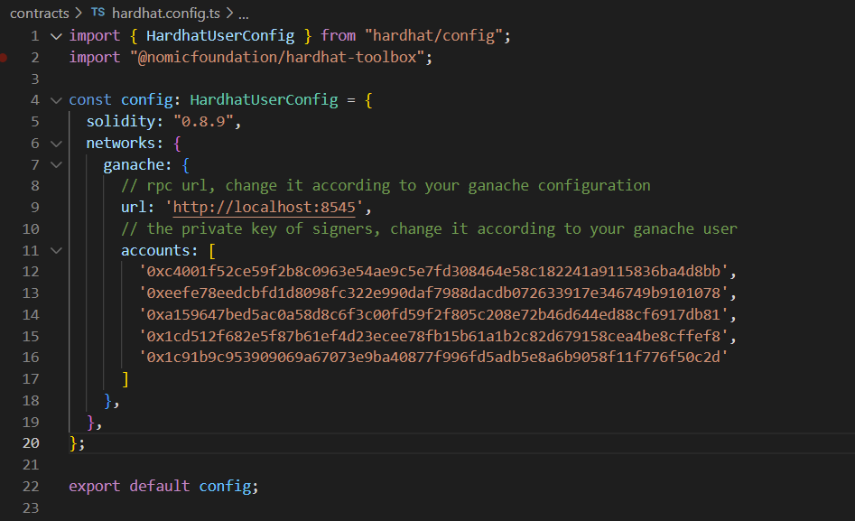

3. 在 `./contracts` 中安装需要的依赖，运行如下的命令：
````
npm install
````
4. 在 `./contracts` 中编译合约，运行如下命令：
````
npx hardhat compile
````
5. 在 `./contracts` 中部署合约，运行如下命令：
````
npx hardhat run ./scripts/deploy.ts --network ganache
````
运行之后会出现如下图片：
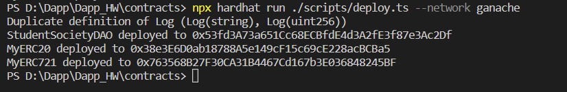
将这三字符串对应复制到如下图所示位置：
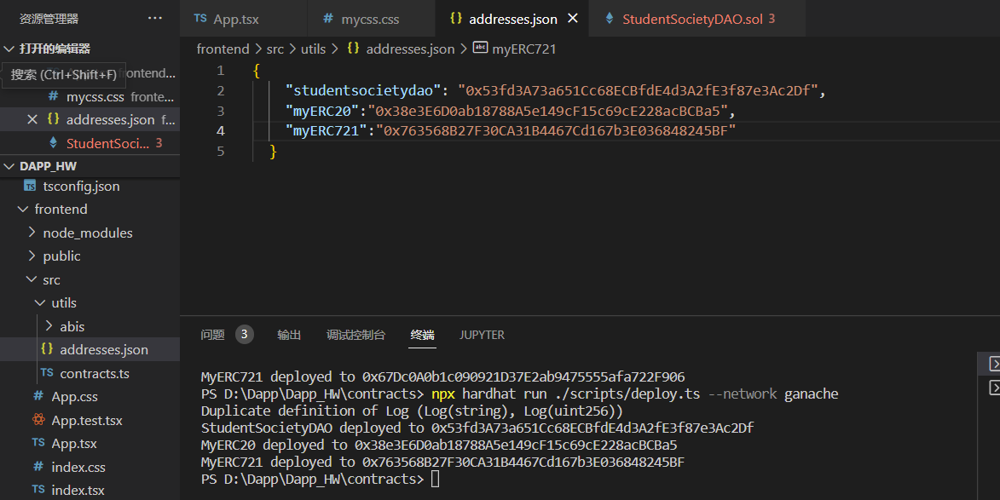

6. 在`./frontend`中安装如下图中所需要的包：
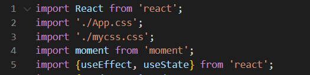
例如用命令`npm install moment --save`安装moment

7. 在`./frontend`中启动前端程序，运行如下的命令：
````
npm run start
````

8. 在google浏览器打开`http://localhost:3000/`
## 功能实现分析
1. 连接钱包

在前端通过和demo中相同的方式让用户可以连接钱包，即如下代码段：
````
const [account, setAccount] = useState('')
useEffect(() => {
    // 初始化检查用户是否已经连接钱包
    // 查看window对象里是否存在ethereum（metamask安装后注入的）对象
    const initCheckAccounts = async () => {
        // @ts-ignore
        const {ethereum} = window;
        if (Boolean(ethereum && ethereum.isMetaMask)) {
            // 尝试获取连接的用户账户
            const accounts = await web3.eth.getAccounts()
            if(accounts && accounts.length) {
                setAccount(accounts[0])
            }
        }
    }

    initCheckAccounts()
  }, [])
  const onClickConnectWallet = async () => {
        // 查看window对象里是否存在ethereum（metamask安装后注入的）对象
        // @ts-ignore
        const {ethereum} = window;
        if (!Boolean(ethereum && ethereum.isMetaMask)) {
          alert('MetaMask is not installed!');
          return
        }

        try {
            // 如果当前小狐狸不在本地链上，切换Metamask到本地测试链
            if (ethereum.chainId !== GanacheTestChainId) {
                const chain = {
                    chainId: GanacheTestChainId, // Chain-ID
                    chainName: GanacheTestChainName, // Chain-Name
                    rpcUrls: [GanacheTestChainRpcUrl], // RPC-URL
                };

                try {
                    // 尝试切换到本地网络
                    await ethereum.request({method: "wallet_switchEthereumChain", params: [{chainId: chain.chainId}]})
                } catch (switchError: any) {
                    // 如果本地网络没有添加到Metamask中，添加该网络
                    if (switchError.code === 4902) {
                        await ethereum.request({ method: 'wallet_addEthereumChain', params: [chain]
                        });
                    }
                }
            }

            // 小狐狸成功切换网络了，接下来让小狐狸请求用户的授权
            await ethereum.request({method: 'eth_requestAccounts'});
            // 获取小狐狸拿到的授权用户列表
            const accounts = await ethereum.request({method: 'eth_accounts'});
            // 如果用户存在，展示其account，否则显示错误信息
            setAccount(accounts[0] || 'Not able to get accounts');
        } catch (error: any) {
            alert(error.message)
        }
    }
````
连接钱包前页面如下图：
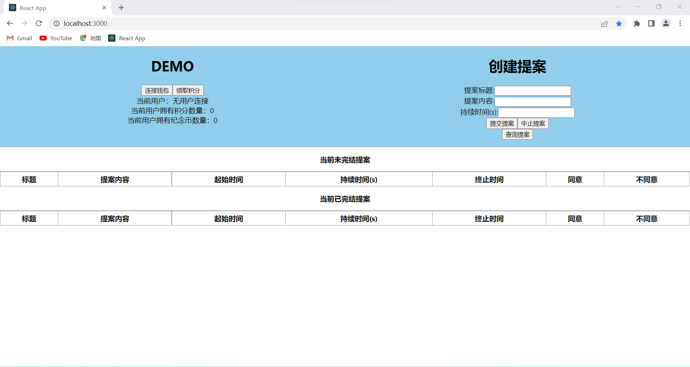
点击连接钱包会出现小狐狸：
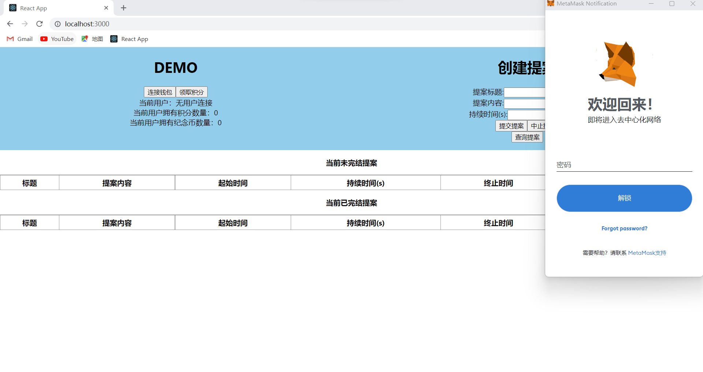
连接成功后当前用户会显示地址：
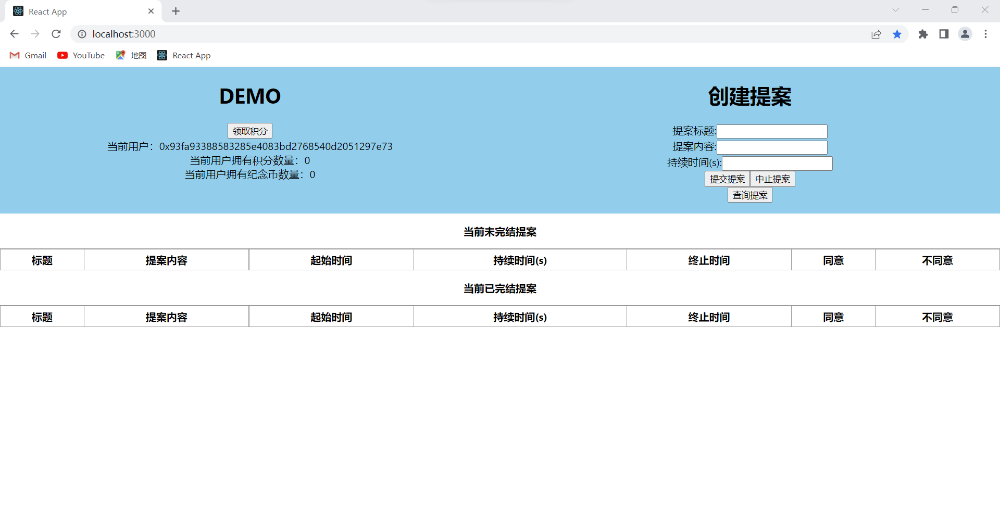

2. 每个学生初始可以拥有或领取一些通证积分（ERC20）。

这个功能参照demo中领取积分功能实现。
在合约中自己创建继承ERC20的合约，用映射记录哪些地址领取过积分，然后利用`_mint(msg.sender, 100)`给没有领过积分的地址发100积分，并将其设为已领积分。
````
contract MyERC20 is ERC20 {

    mapping(address => bool) claimedAirdropPlayerList;

    constructor(string memory name, string memory symbol) ERC20(name, symbol) {
        _mint(msg.sender, 1000000);
    }
    function airdrop() external {
        require(claimedAirdropPlayerList[msg.sender] == false, "This user has claimed airdrop already");
        _mint(msg.sender, 100);
        claimedAirdropPlayerList[msg.sender] = true;
    }
}
````

前端中通过和demo同样的办法获取账户积分数量。
````
const [accountBalance, setAccountBalance] = useState(0)
 useEffect(() => {
        const getAccountInfo = async () => {
            if (myERC20Contract) {
                const ab = await myERC20Contract.methods.balanceOf(account).call()
                setAccountBalance(ab)
            } else {
                alert('Contract not exists.')
            }
        }

        if(account !== '') {
            getAccountInfo()
        }
    }, [account])
````
领取积分后会显示当前积分，且小狐狸会报Confirmed transaction：
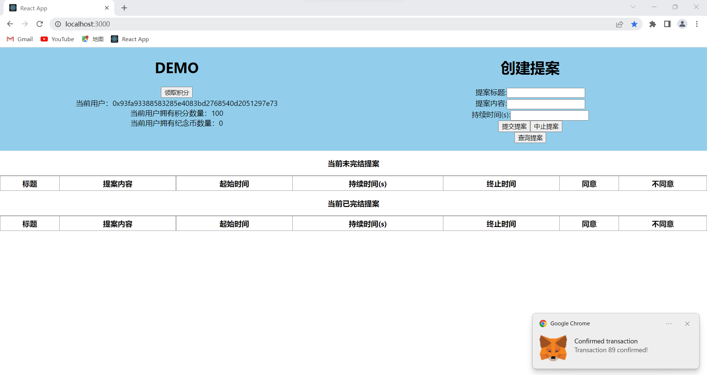
如果多次领取会提示已经领取过。

3. 学生可以使用一定数量通证积分，发起关于该社团进行活动或制定规则的提案（Proposal）

在合约中为Proposal创建如下结构体：
其中index为proposal的唯一序号，proposer为提案发起人，startTime为提案发起时间，duration为提案持续时间，name为提案标题，content为提案内容，agree为提案的同意数量，disagree为提案的反对数量，state为提案当前状态，即提案是否已经结束。
````
struct Proposal {
    uint32 index;      // index of this proposal
    address proposer;  // who make this proposal
    uint256 startTime; // proposal start time
    uint256 duration;  // proposal duration
    string name;       // proposal name
    string content;
    uint agree;
    uint disagree;
    bool state;
}
````
然后为能创建提案，在合约中提供如下函数：
其中`pros`为提案结构体数组`Proposal[] public pros`，total_index为全局变量，每次加一，CREATE_AMOUNT为定义的常量，代表着创建提案要花费的积分。
````
function createproposal(string memory pro_name,string memory pro_con,uint256 newduration) external{
    studentERC20.transferFrom(msg.sender, address(this), CREATE_AMOUNT);
    pros.push(Proposal({
        index: total_index,
        proposer: msg.sender,
        startTime: block.timestamp,
        duration: newduration,
        name: pro_name,
        content :pro_con,
        agree: 0,
        disagree: 0,
        state: false
    }));
    total_index++;
}
````
然后在前端中用如下两个函数调用合约中的创建提案函数：
其中在`oncreateproposal`函数中首先判断账户已连接，然后如果合约已部署，先允许转账，然后调用合约中的创建提案函数，然后更新状态。
````
submintPro = () =>{
    if(this.state.new_proposal!=''){
        this.oncreateproposal(this.state.title,this.state.new_proposal,this.state.duration)
    }
}

oncreateproposal = async (title:any,new_pro:any,duration:any) => {
    if(account === '') {
        alert('You have not connected wallet yet.')
        return
    }
        
    if (studentsocietydaoyContract && myERC20Contract) {
        try {
            await myERC20Contract.methods.approve(studentsocietydaoyContract.options.address, playAmount).send({
                from: account
            })
            await studentsocietydaoyContract.methods.createproposal(title,new_pro,duration).send({
                from: account
            })
            const newab = await myERC20Contract.methods.balanceOf(account).call()
            setAccountBalance(newab)
                }
        catch (error: any) {
            alert(error.message)
        }
    } else {
        alert('Contract not exists.')
    }
    this.setState({
        list: await studentsocietydaoyContract.methods.getProposals().call()
    })
}
````
创建提案时在对应位置输入内容，然后点击提交提案并确定花费即可：
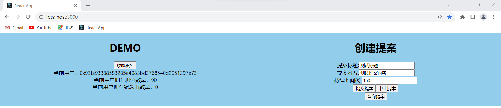

4. 前端提案信息：
在合约中提供如下函数来供获取提案信息：
````
function getProposals() external view returns(Proposal[] memory){
    Proposal[] memory result = new Proposal[](pros.length);
    for(uint i = 0;i<pros.length;i++){
        result[i] = pros[i];
    }
    return result;
}
````

在前端通过`getPro`函数获取提案信息：
其中通过`call`来调用函数获取返回信息并存储在list中以供渲染。这一过程当时遇到了很多问题，最开始用send来调用函数发现返回的信息无法解析，后来发现用call即可，然后在渲染列表时发现返回的结构体数组属性是never[]，无法直接获取其中的信息，但是通过列表的map功能成功渲染出列表。
````
getPro = async () =>{
    if(account === '') {
        alert('You have not connected wallet yet.')
        return
    }
    if(account === '') {
        alert('You have not connected wallet yet.')
        return
    }
    if (studentsocietydaoyContract) {
        try {
            this.setState({
                list: await studentsocietydaoyContract.methods.getProposals().call()
            })
        } catch (error: any) {
            alert(error.message)
        }
    } 
    else {
        alert('Contract not exists.')
    }
}
````
然后点击查询提案即可获取当前提案信息：
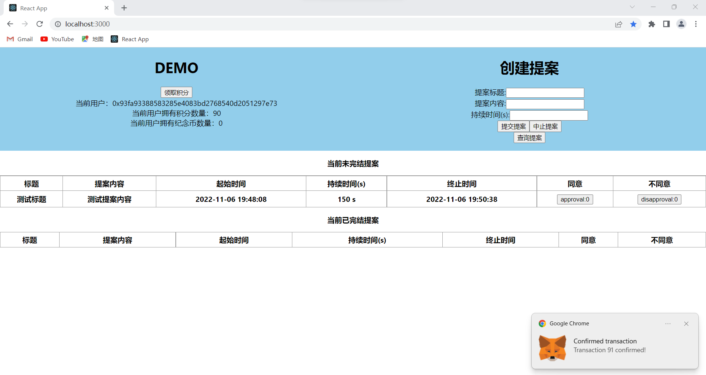

5. 赞成与反对功能

赞成和反对都需要在提案结束时间之前，且限制每人对一个提案只能投一次票。利用如下结构和映射判断一个地址是否投过票：
````
struct Voter {
    mapping(uint=>bool) voted;   //以此映射判断对某个提案是否投过票
    uint vote;   // 投票提案的索引
    uint count;  //发布的通过的提案的数量
}
mapping(address => Voter) public voters;
````
在合约中提供如下两个函数支持赞成与反对功能：
这两个函数接受的参数都是提案的唯一序号，然后根据这个唯一序号来定位对应的提案，首先判断提案是否已经结束，然后根据`msg.sender`来获得投票人地址，利用映射判断该投票人是否已经对这个提案投过票，如果没有投票，则将其变成已投票，并改变对应提案的赞成反对数量并消耗投票所需的积分。
````
function approve(uint pro_index) external{
    require((pros[pro_index].startTime+pros[pro_index].duration)>block.timestamp, "Proposal has ended");
    Voter storage sender = voters[msg.sender];
    require(!sender.voted[pro_index], "Already voted.");
    sender.voted[pro_index] = true;
    sender.vote = pro_index;
    pros[pro_index].agree += 1;
    studentERC20.transferFrom(msg.sender, address(this), VOTE_AMOUNT);
    emit Approve(msg.sender);
}
function disapprove(uint pro_index) external{
    require((pros[pro_index].startTime+pros[pro_index].duration)>block.timestamp, "Proposal has ended");
    Voter storage sender = voters[msg.sender];
    require(!sender.voted[pro_index], "Already voted.");
    sender.voted[pro_index] = true;
    sender.vote = pro_index;
    pros[pro_index].disagree += 1;
    studentERC20.transferFrom(msg.sender, address(this), VOTE_AMOUNT);
    emit Disapprove(msg.sender);
}
````
赞成或反对都需要确定花费：
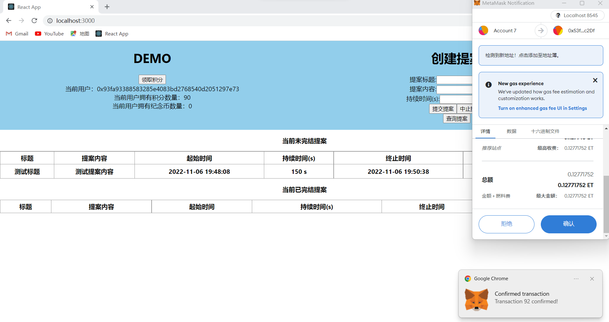
然后对应的赞成和反对就会被提交：
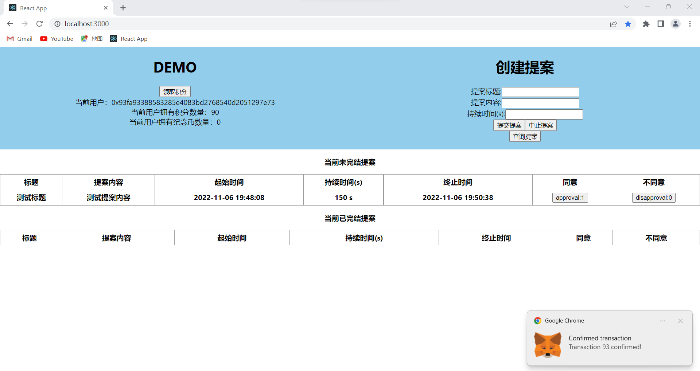
此时再对此提案提交赞成或反对都会无效，小狐狸会报告交易失败。
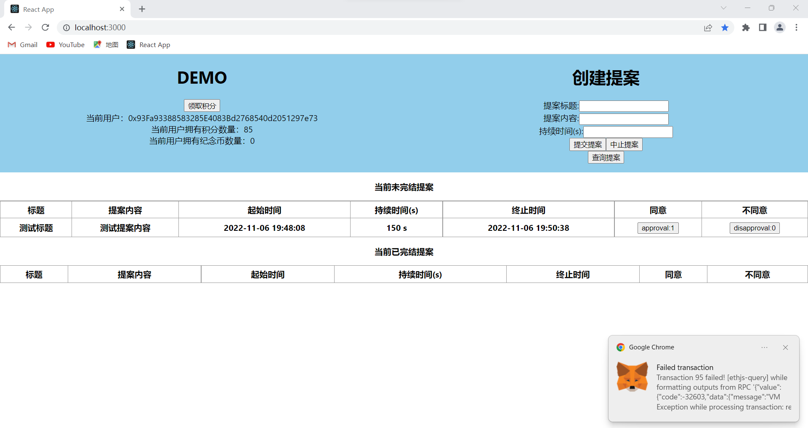

6. 结束提案以及对发起提案并通过3次的学生分发纪念品（ERC721）
因为智能合约中更改状态都需要消耗gas，所以无法自动结束提案，需要有人提供gas消耗，所以在合约中提供结束提案功能，并对成功结束了的用户提供积分奖励。且在此功能中会记录成功的提案的发起者已经成功通过了几个提案，并对其进行奖励纪念品（ERC721）。其中`reward`用来标识是否成功结束提案，即是否需要对其进行积分奖励，而新结束的提案会根据`proposer`找到它的发起人并增加其成功提案数量，如果数量达到3，则将其清空并奖励纪念品。
````
function endproposal() external{
    bool reward = false;
    for(uint i = 0;i<pros.length;i++){
        if(pros[i].startTime+pros[i].duration<block.timestamp){
            reward = true;
            if(pros[i].state==false&&(pros[i].agree>pros[i].disagree)){
                studentERC20.transfer(pros[i].proposer ,WIN_AMOUNT);
                voters[pros[i].proposer].count++;
                if(voters[pros[i].proposer].count==3){
                    my721.awardItem(pros[i].proposer);
                    voters[pros[i].proposer].count = 0;
                }
            }
            pros[i].state = true;
        }
    }
    if(reward){
        studentERC20.transfer(msg.sender ,5);
    }
}
````
其中创建我的继承ERC721的合约如下：其中提供了给特定地址发送纪念品的函数`awardItem`。
````
contract MyERC721 is ERC721 {
    using Counters for Counters.Counter;
    Counters.Counter private _tokenIds;
    constructor(string memory name, string memory symbol) ERC721(name, symbol) {
    }
    uint32 total_index;
    function awardItem(address player)
        public
        returns (uint256)
    {

        uint256 newItemId = total_index;
        total_index = total_index+ 15;
        _mint(player, newItemId);
        return newItemId;
    }
}
````
我首先创建了如下测试提案：
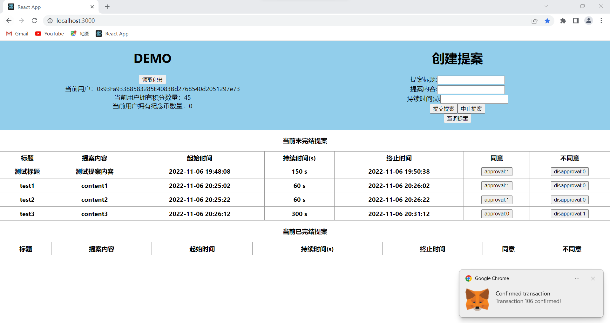
然后在时间达到前三个提案结束后点击结束提案：
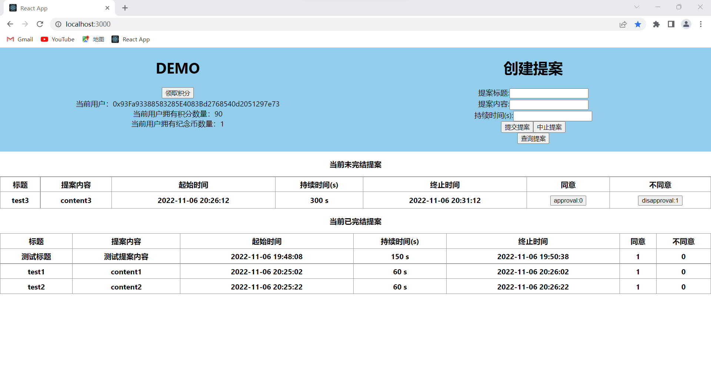
可见，时间到达结束时间的提案已经结束，时间未达到结束时间的提案不会结束，且成功通过的提案会奖励发布者积分，且发起提案并通过3次的学生收到了纪念品奖励。
## 参考内容
参考课程Demo中的`demo-lottery-application`
参考b站课程: 基于以太坊的智能合约开发教程【Solidity】`https://www.bilibili.com/video/BV1St411a7Pk/?spm_id_from=333.337.search-card.all.click`
参考solidity中文文档`https://learnblockchain.cn/docs/solidity/`
以及参考了许多教react内容的教程
